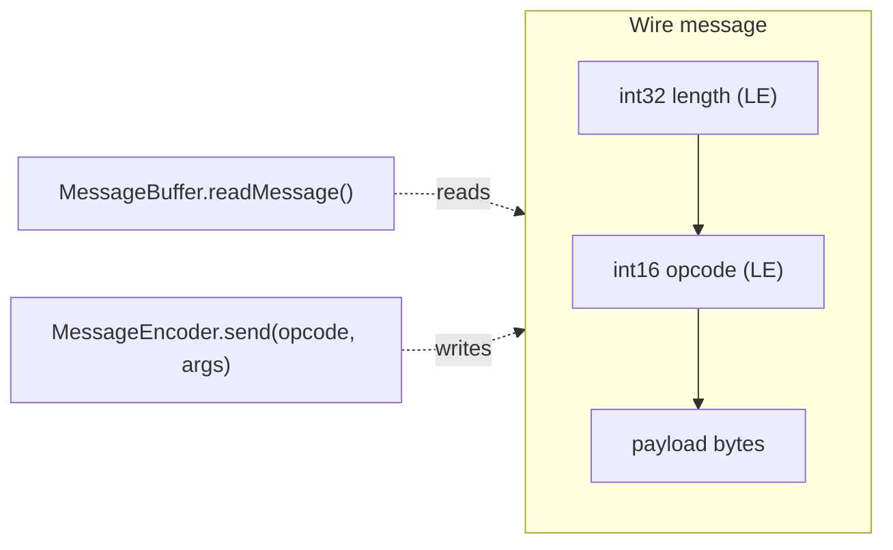

# API, protocol and external interfaces

[← Index](README.md) · [Architecture](ARCHITECTURE.md) · [Classes](CLASSES.md) · [Development](DEVELOPMENT.md)

---

## 4.1 Is there an API?

**There is no in-app REST/HTTP API or served endpoints.** Sancho is a **desktop application**, not a
service: it exposes no ports or routes. Its "interfaces" are:

1. The **binary MLDonkey GUI protocol** it speaks as a _client_ to the core (TCP).
2. The **command-line arguments**.
3. Two **outbound HTTP calls** to GitHub (update check).
4. The **Windows registry import** (associations), documented in `../README.md`.

- _Not deducible from code:_ no formal MLDonkey protocol spec lives in this tree; each opcode's layout
  is only inferable from the **order of `read*`/`send` calls**.

---

## 4.2 MLDonkey GUI protocol

TCP client, **little-endian**, version negotiated up to `41` (`MLDonkeyCore.MAX_PROTOCOL = 41`).

### 4.2.1 Framing

Each wire message: `[int32 length][int16 opcode][payload]`.



- **Reading** — `MessageBuffer.readMessage()` (`sancho/model/mldonkey/utility/MessageBuffer.java:220`)
  reads the 4-byte length (LE), loads the payload and returns the `getUInt16()` opcode; a cursor walks
  the array.
- **Writing** — `MessageEncoder.send(opCode, Object[] args)` (`.../utility/MessageEncoder.java:86`)
  serializes into a `ByteArrayOutputStream`, prepends the 6-byte header `[int32 len][int16 opcode]` and
  flushes to the socket.

### 4.2.2 Wire primitives

`MessageBuffer` readers (all LE):

| Type | Method | Note |
|---|---|---|
| uint8 / bool | `getByte`/`getInt8`, `getBool` | |
| uint16 | `getUInt16` | |
| int32 / signed | `getInt32`, `getSignedInt32` | sign is protocol-dependent |
| uint64 | `getUInt64` | 8 bytes |
| float | `getFloat` | **transmitted as a string** (lossy) |
| string | `getString` | uint16 length (or `65535`→int32); **UTF-8** and `intern()`ed |
| lists | `getStringList`, `getInt32List` | uint16 count + elements |
| IP | `getIP` | 4 raw bytes |
| MD4 | `getMd4` | 16 bytes; all-zero → `null` |
| tags | `getTagList` | see `Tag` |

Writing (`MessageEncoder`): `byte[]` raw; `Object[]` as `[uint16 count]` + elements; scalars via
`appendObject` (`Byte`, `Number` → 2/4/8 bytes LE, `String` → uint16 + UTF-8).

### 4.2.3 Opcodes

Defined in `sancho/model/mldonkey/utility/OpCodes.java` (two namespaces whose values overlap between
directions). **Caveat:** the `OpCodes` constants are essentially unused; the actual dispatch
(`processMessage`) and the `send`s use **numeric literals**, a maintenance risk (see
[ARCHITECTURE §2.7](ARCHITECTURE.md#27-improvement-areas)).

#### Incoming (core → GUI, `R_*`)

| Opcode | Constant | Effect (collection / action) |
|---:|---|---|
| 0 | `R_CORE_PROTOCOL` | `readCoreProtocol`: negotiate protocol, build `CollectionFactory`, send password/version, start `Timer` |
| 1 | `R_OPTIONS_INFO` | options + `notifyInitialized` |
| 4 / 5 / 6 | `R_RESULT_INFO` / `R_SEARCH_RESULT` | `ResultCollection` |
| 15 / 16 / 18 | `R_CLIENT_INFO` | `ClientCollection` |
| 19 | `R_CONSOLE` | console |
| 20 / 59 | `R_NETWORK_INFO` / `R_STATS` | `NetworkCollection` / network stats |
| 21 | — | users |
| 23 / 24 / 31 / 32 | `R_ROOM_INFO` … | rooms |
| 26 / 13 | `R_SERVER_INFO` | `ServerCollection` |
| 27 | — | `ClientMessage` (private message; notified directly) |
| 34 / 35 / 48 | `R_SHARED_FILE_INFO` | `SharedFileCollection` |
| 46 | `R_FILE_DOWNLOAD_UPDATE` | `FileCollection.update` |
| 47 | `R_BAD_PASSWORD` | bad password / disconnect |
| 49 | — | client statistics (bandwidth) |
| 51 | `R_CLEAN_TABLES` | prune clients/servers/files |
| 52 / 53 | — / `R_DOWNLOADING_LIST` | file add / full list |
| 58 | — | MLDonkey version string |

#### Outgoing (GUI → core, `S_*`)

| Opcode | Constant | Use |
|---:|---|---|
| 0 | `S_CORE_PROTOCOL` | announce GUI protocol version (41) |
| 8 | `S_DLLINK` | **download by link** (ed2k/magnet/sig2dat/torrent) |
| 9 | `S_REMOVE_SERVER` | remove server |
| 13 | `S_SAVE_FILE_AS` | save as |
| 14 | `S_ADD_CLIENT_FRIEND` | add friend |
| 20 | `S_CONNECT_ALL` | connect to all |
| 23 | `S_SWITCH_DOWNLOAD` | pause/resume |
| 28 / 29 | `S_SET_OPTION` / `S_CONSOLE_MESSAGE` | option / console command |
| 34 | `S_GET_FILE_LOCATIONS` | request sources |
| 42 | `S_SEARCH_QUERY` | run search |
| 50 / 51 | `S_DOWNLOAD` / `S_SET_FILE_PRIO` | download / priority |
| 52 | `S_PASSWORD` | login `{password, username}` |
| 64 / 65 | `S_INTERESTED_IN_SOURCES` / `S_GET_VERSION` | handshake |

Examples of sends from entities (with **literals**): `File.saveFileAs` → `send((short)13,…)`
(`File.java:1005`); `Server.setState` maps to 22/9/21 (`Server.java:349`); `FileCollection.dllink` →
`send((short)8, link)` (`FileCollection.java:121`).

### 4.2.4 Authentication

Login is opcode 52 with `{password, username}` during the handshake (`MLDonkeyCore.sendPassword`,
`:464-466`). `notifyInitialized()` marks `initialized` when the core replies with options/stats; if it
never initializes, `checkIfDenied()` marks `connectionDenied`. **The password travels in clear** over
the socket (only mitigated by the SSH tunnel).

---

## 4.3 Command-line arguments

Parsed in `sancho.core.Sancho` (`main`→`parseArgs`, `Sancho.java:239-249`). Flags accept a `-x` **or**
`/x` prefix (`argCheck`, `:58-64`). A bare non-flag argument is treated as a **link** to send to the
core (`:245`).

### Value flags (`parseDouble`, `:273-309`)

| Flag | Value | Effect |
|---|---|---|
| `-c` | `<file>` | Preference file (`PreferenceLoader.setPrefFile`) |
| `-j` | `<directory>` | Home/preferences directory (`setHomeDirectory`) |
| `-l` | `<link>` | Add ed2k/magnet/sig2dat/torrent link to send |
| `-r` / `-R` | `<value>` | `PreferenceLoader.jvm` (**not listed in** `printHelp`) |
| `-f` | `<xx_XX>` | Force locale (`setLocaleString`) |
| `-h` / `-H` | `<host:port>` | Core host:port (`coreFactory.setHostPort`) |
| `-u` / `-U` | `<user>` | Username |
| `-p` / `-P` | `<password>` | Password |

### Boolean flags (`parseSingle`, `:311-341`)

| Flag | Effect |
|---|---|
| `-?` | Help and exit |
| `-v` / `-V` | Version and exit |
| `-d` | **Debug** (bypasses the instance lock; stack trace instead of `BugDialog`) |
| `-b` | No browser tab |
| `-m` | Monitor mode (bandwidth only) |
| `-n` | No core (`noCore`) |
| `-min` | Start minimized |
| `-tray` | Start in the tray |

### Examples

```bash
# Normal GUI
java -jar sancho-<ver>-<plat>.jar

# Connect to a remote core
java -jar sancho.jar -H 192.168.1.10:4001 -u admin -p secret

# Send a link to a running core WITHOUT opening the GUI (automated mode)
sancho -l "ed2k://|file|example.iso|123456|ABCDEF...|/"

# This is how the Windows associations invoke it:  sancho.exe -l "%1"
```

When links are passed, the app enters **automated mode**: connect, send, exit (`Sancho.java:208-213`,
`:66-78`).

---

## 4.4 Outbound HTTP calls (update check)

Not an in-app API, but **consumption** of the GitHub Releases API:

| Use | URL | Source |
|---|---|---|
| Latest release (JSON) | `https://api.github.com/repos/vsc55/sancho-p2p/releases/latest` | `VersionInfo.getReleasesApiURL()` (`:77-79`) |
| Releases page (browser) | `https://github.com/vsc55/sancho-p2p/releases` | `VersionInfo.getReleasesPage()` (`:81-83`) |

The checker (`sancho.view.utility.VersionChecker`) GETs the JSON with a `User-Agent` and `Accept:
application/vnd.github+json`, extracts `tag_name` with a regex and **compares it by equality** with the
current version (it does not order versions): if they differ, it reports a new version.

- _Not deducible from code:_ the historical endpoints in `VersionInfo` (SourceForge, awardspace) are
  **dead**; only the GitHub ones are live.
