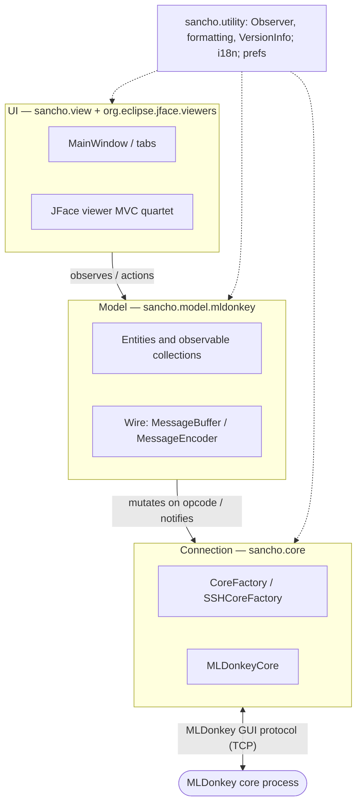

# Architecture

[← Index](README.md) · [Classes](CLASSES.md) · [API / Protocol](API.md) · [Development](DEVELOPMENT.md)

---

## 2.1 Package structure

415 `.java` files (tree recovered by decompilation and modernized). Breakdown by package:

| Package | Files | Role |
|---|---:|---|
| `sancho.core` | 7 | Entry point, core connection, protocol reader thread |
| `sancho.model.mldonkey` | 60 | Domain entities and observable collections |
| `sancho.model.mldonkey.utility` | 24 | Wire format: `MessageBuffer`/`MessageEncoder`, opcodes, `Tag`, `Addr`, `Kind`… |
| `sancho.model.mldonkey.enums` | 15 | Typed protocol enumerations |
| `sancho.utility` | 5 | `SwissArmy`, `VersionInfo`, `ObjectMap`, `MyObservable`/`MyObserver` |
| `sancho.view` (+ ~30 subpackages) | ~290 | UI layer: `MainWindow`, tabs, viewer framework, preferences, i18n |
| `org.eclipse.jface.viewers` | 3 | Classes **injected** into JFace's package (custom virtual viewers) |

Notable `sancho.view` subpackages: `viewer` (table/tree MVC base: `table`, `tree`, `actions`,
`filters`), `preferences`, `mainWindow`, `viewFrame`, `utility` (`AbstractTab`, `WidgetFactory`,
`SResources`, `setupWizard`, `dialogs`), plus one subpackage per feature (`transfer/*`, `search/*`,
`server/*`, `rooms/*`, `friends/*`, `shares`, `statistics/*`, `console`, `downloadComplete`,
`statusline/*`).

Layers (bottom to top):



## 2.2 Main modules

- **Startup & connection (`sancho.core`)** — static `Sancho` class (entry point and global state);
  `CoreFactory`/`SSHCoreFactory` (connection management, connect dialogs, SSH tunnel); `MLDonkeyCore`
  (the live connection: reader thread, opcode dispatch, 777 ms polling `Timer`); `MLDonkeyCoreMonitor`
  (monitor mode); `ICore` (contract). Detail in [CLASSES.md §3.1.1](CLASSES.md#311-package-sanchocore).

- **Model & protocol (`sancho.model.mldonkey`)** — entities (`File`, `Client`, `Server`, `Result`,
  `Room`, `User`, `Network`, `SharedFile`) and observable collections (`ACollection_Int` + subclasses).
  A `utility` subpackage holds the wire format (`MessageBuffer`, `MessageEncoder`, `OpCodes`) and an
  `enums` subpackage. Two **protocol-version factories** (`CollectionFactory`, `UtilityFactory`) let it
  talk to cores of protocol 16–41. Detail in [CLASSES.md §3.2](CLASSES.md#32-data-model).

- **UI (`sancho.view`)** — `MainWindow` (root + event loop), one tab per feature (all extend
  `AbstractTab`), and the **JFace MVC quartet** repeated per table/tree: _View + ContentProvider +
  LabelProvider + Sorter + MenuListener_ over the base classes in `sancho.view.viewer`. Preferences
  framework in `sancho.view.preferences`. i18n in `SResources`. Detail in
  [CLASSES.md §3.1.3](CLASSES.md#313-package-sanchoview-ui).

- **Injected JFace (`org.eclipse.jface.viewers`)** — `ICustomViewer`, `CustomTableViewer`,
  `CustomTreeViewer`: a custom **virtual (lazy) table/tree** implementation compiled inside JFace's
  package to reach package-private members. Forces consuming **unsigned JFace** (see 2.4).

- **Utilities (`sancho.utility`)** — `MyObservable`/`MyObserver` (custom observer pattern with an extra
  `int flags`), `ObjectMap` (observable set with weak deltas), `SwissArmy` (formatting, human-readable
  sizes, link regexes, env-var expansion, process spawning), `VersionInfo` (name/version/platform/URLs).

## 2.3 Design patterns identified

| Pattern | Where | Note |
|---|---|---|
| **Observer** (custom) | `MyObservable`/`MyObserver`; collections, entities and `ObjectMap` are observable; `MainWindow` observes `CoreFactory` (`MainWindow.java:112`); every content provider observes its `ObjectMap` | `update(MyObservable, Object arg, int flags)` — the `int flags` carries the change code (e.g. `Client.CONNECTED`, `File.CHANGED_*`, `ObjectMap.ADDED/UPDATED/REMOVED`) |
| **Factory** | `CoreFactory`/`SSHCoreFactory` (create the `ICore`); `CollectionFactory`/`UtilityFactory` (protocol-version variants); `WidgetFactory` (SWT widgets); `SResources` (string/image registry) | `CollectionFactory` is a **mutable singleton** (limitation: prevents concurrent cores) |
| **Template method** | `GView.createContents()` fixes the wiring sequence; `AbstractTab.createContents()`; `ViewFrame`/`ViewListener` | Subclasses fill in `createColumns`, `getContentProvider`, `_compare`, `getColumnText`… |
| **Provider (JFace MVC)** | `GTableContentProvider`/`GTableLabelProvider`/`GSorter`/`GTableMenuListener` and their 17–21 concretions | The model (`ObjectMap` collection) feeds the virtual viewer |
| **Adapter** | `MLDonkeyPreferenceStore` adapts the core's `OptionCollection` to JFace's `IPreferenceStore` | Editing a "core" page mutates the core, not the local file |
| **Strategy / version subclassing** | `SSHCoreFactory` overrides `startCore()`; `MLDonkeyCoreMonitor` overrides `processMessage()`; entities `File18…File41`, `Server28…40`, `Client19…35` | Protocol version picks the subclass |
| **Command / Action** | JFace `Action`s in `viewer/actions`, `viewFrame/actions`, `statusline/actions` | |
| **Singleton (de facto)** | `Sancho` (all static: `Display`, `CoreFactory`, `ExecConsole`); static `PreferenceLoader` and `SResources` | Global mutable state |
| **Typesafe enum** | `sancho.model.mldonkey.enums.*` extend `AbstractEnum` with static singletons | Not Java `enum`s; carry `byteToEnum`/`intToEnum` decoders |

## 2.4 The `org.eclipse.jface.viewers` injection (deliberate coupling)

Three classes (`ICustomViewer`, `CustomTableViewer`, `CustomTreeViewer`) are compiled **inside** the
`org.eclipse.jface.viewers` package so they can subclass `TableViewer`/`TreeViewer` and access
package-private members. They provide a **virtual (lazy) table/tree** with their own
element↔`TableItem` map (`parentToItemMap`), selection marshalling and fixes for stale/duplicate/
"stuck" rows (see comments in `CustomTableViewer.myClear`/`replace`).

Build consequence: the JVM **refuses to load user classes into a signed package**, so JFace must be
consumed **unsigned** — a local `org.sancho.thirdparty:org.eclipse.jface:3.31.0-unsigned` artifact
from `local-repo/`, regenerated by `tools/unsign-libs.ps1` (`pom.xml:31-35`, `:55-59`). SWT is **not**
injected into, so the stock signed fragment is used per platform. It is load-bearing coupling:
upgrading JFace requires re-porting these classes.

## 2.5 General application flow

1. **Interactive mode (GUI):** `Sancho.main` creates the `Display`, parses arguments, initializes
   preferences/i18n, creates `SSHCoreFactory` and starts its daemon **connect thread**. If
   `coreExecutable` is set, it launches the local core. It builds `MainWindow`, which runs the **SWT
   event loop** until the window closes. In parallel, `MLDonkeyCore`'s **reader thread** decodes socket
   messages and mutates the model; the model notifies content providers, which refresh tables via
   `asyncExec`. A **`Timer`** (777 ms) polls statistics and refreshes the file list.

2. **Automated mode (send link):** `sancho -l <link>` (or a bare argument that is a link) does not open
   the GUI: it connects, sends the links to the core (`S_DLLINK`, opcode 8) and exits. This is how the
   OS invokes the Windows associations (`sancho.exe -l "%1"`).

3. **Monitor mode:** `-m` uses `MLDonkeyCoreMonitor`, which only processes handshake, disconnect and
   client statistics (bandwidth).

---

## 2.6 Execution flow (step by step)

### 2.6.1 Startup to an operational window

Source: `Sancho.main` (`sancho/core/Sancho.java:187-237`).

1. `Display.setAppName("sancho")` and `new Display()` on the main thread (SWT UI thread) (`:191-192`).
2. Registers a _Dispose_ `Listener` that deletes the lock file on exit (`:193-199`).
3. Creates the factory: `coreFactory = new SSHCoreFactory(display)` (`:204`). SSH stays idle unless
   `use_ssh` preferences are present.
4. `parseArgs(args)` (`:205`) — see [API.md §Arguments](API.md#43-command-line-arguments).
5. `initializeResources()` (`:143`): `PreferenceLoader.initialize()`, `SResources.initialize()`,
   `PreferenceLoader.initialize2()`; deletes stale `exit.log`/`console.msg`.
6. `coreFactory.initialize()` (`:207`): reads host-0 preferences and starts the **daemon connect
   thread** (`CoreFactory.java:170-172`), which (every 1 s) connects when `core == null &&
   wantToConnect`.
7. If links were collected → **automated mode** (`automatedLaunch`, `:66`) then `exit(0)`.
8. **Single instance** (unless `debug` or the `allowMultipleInstances` pref): `<home>/.lock` file. If
   it exists, a yes/no `MessageBox`; if the user cancels, `exit(0)` (`:215-233`). _(Existence-only
   check on an empty file; no `FileLock` — see §2.7.)_
9. `interactiveLaunch()` (`:164-185`): shows `Splash`; if `coreExecutable` set → `spawnCore()` (waits
   up to ~59 s for `coreStarted()`); if `noCore` **or** `coreFactory.interactiveConnect() == 0` → `new
   MainWindow(display)` (blocks running the event loop). On return: `saveStore()`, `cleanUp()`,
   `disconnect()` if still connected, delete the lock, `Splash.dispose()`.

### 2.6.2 Connection establishment (threads involved)

```mermaid
sequenceDiagram
    autonumber
    participant M as "Sancho.main (UI thread)"
    participant CF as "CoreFactory (connect thread, daemon)"
    participant Core as "MLDonkeyCore (reader thread, daemon)"
    participant K as "MLDonkey core"

    M->>M: new Display(); parseArgs; init prefs/i18n
    M->>CF: new SSHCoreFactory + initialize()
    Note over CF: connect loop polls every 1s
    M->>M: interactiveLaunch(): Splash; maybe spawnCore()
    M->>CF: interactiveConnect()
    CF->>K: optional SSH tunnel, then new Socket(host,port)
    CF->>Core: new MLDonkeyCore(socket,...); start reader thread
    Core->>K: send GUI protocol version (op 0 = 41)
    K-->>Core: core protocol
    Core->>K: password (op 52); interested-in-sources; get-version
    Note over Core: build CollectionFactory; start 777ms Timer
    M->>M: new MainWindow(display) runs the SWT event loop
```

### 2.6.3 Handshake and message loop

Source: `MLDonkeyCore.run()` (`:400-436`) and `readCoreProtocol` (`:220-237`): the reader thread sends
the GUI protocol version (op 0 = 41), the core replies with its protocol, `activeProtocol =
min(coreProtocol, 41)` is fixed, password/interested/get-version are sent, the `CollectionFactory` is
built and the 777 ms `Timer` starts. Then it loops `opcode = messageBuffer.readMessage();
processMessage(opcode, messageBuffer)` while `connected`. See
[API.md §Protocol](API.md#42-mldonkey-gui-protocol).

### 2.6.4 Typical operation — receive a download update

```mermaid
sequenceDiagram
    autonumber
    participant K as "MLDonkey core"
    participant Core as "MLDonkeyCore (reader thread)"
    participant FC as "FileCollection"
    participant F as "File"
    participant UI as "content provider / table (UI thread)"

    K-->>Core: op 46 (R_FILE_DOWNLOAD_UPDATE)
    Core->>FC: processMessage(46, buffer)
    FC->>F: readUpdate(buffer) mutates downloaded/rate; sets changedBits
    F->>F: notifyChangedProperties() (setChanged; notifyObservers)
    FC->>FC: setChanged()
    Note over FC: throttled sendUpdate() every updateDelay*777ms if hasChanged()
    FC-->>UI: observer callback
    UI->>UI: asyncExec { tableViewer.update(...) } repaints the row
```

### 2.6.5 Typical operation — download a result / send a link

Double-click a result or `sancho -l <link>` → `FileCollection.dllink(link)` → `core.send((short)8,
link)` (`FileCollection.java:121`) → `MessageEncoder.send` serializes `[len][opcode 8][string]` and
writes it to the socket.

---

## 2.7 Improvement areas

Consolidated from the analysis of all four areas. Many are decompilation artifacts.

### 2.7.1 Duplicated code

- **The MVC quartet replicated ~17-21 times** in `sancho.view`: ~17 `*TableView`, ~21
  `*ContentProvider`, ~19 `*LabelProvider`, ~19 `*Sorter`, ~19 `*MenuListener`, ~28 `*ViewFrame`, ~26
  `*ViewListener`. Each feature reimplements the same boilerplate and differs only in the column set,
  the model type and the `_compare`/`getColumnText` bodies. A fix must be replicated N times.
- **Protocol-version subclass explosion** (`File18…File41`, `Server28…40`, `Client19…35`) — a lot of
  near-duplicated override scaffolding; a data-driven / capability-flag decoder would collapse most.
- **Copy-pasted `readPreferences`** (~20 repetitions of the same `field = (field != sentinel &&
  !reload) ? field : PreferenceLoader.load…("hm_"+i+"_…")` idiom) in `CoreFactory`/`SSHCoreFactory`.
- **Logic repeated across entities** (`getED2K()`, `readSize()`, `preview()`, `containsFake` regex
  checks) between `File`/`Result`/`SharedFile`. Overlapping enums (`EnumType` vs `EnumTagType`).
- Duplicated `send(...)` triplet in `Sancho` and `MLDonkeyCore`; near-identical proxy blocks in
  `SSHCoreFactory.addProxy`.

### 2.7.2 High complexity

- `MLDonkeyCore.processMessage` — a ~60-case / ~150-line `switch` (`:239-392`) using **numeric
  literals** instead of the `OpCodes` constants (risk of silent drift).
- `ResultCollection` — two-level structure (flat result map + per-search map with `ObjectMap` and cross
  indexes).
- `SResources` — a static initializer that loads the bundle + ~250 images at class-load, coupling
  i18n, preferences and `VersionInfo` by load order.

### 2.7.3 Technical risks

- **Fragile/racy single-instance lock** (`Sancho.java:215-233`): existence check on an empty file, no
  `FileLock`; TOCTOU between `exists()` and `createLockFile()`; a crash leaves a stale lock (partly
  mitigated by `deleteOnExit` + the dispose listener).
- **Busy-wait instead of synchronization**: the connect loop (1 s), the handshake `semaphore`,
  `spawnCore` (~59 s), `successfulConnect`. No `wait/notify`/`CountDownLatch`/`Future`: wastes CPU and
  adds latency.
- **Manual, unenforced UI threading**: correctness depends on **every** core-thread callback wrapping
  its work in `asyncExec` and re-checking `isDisposed()`. A new path mutating a widget off the UI
  thread fails at runtime. The virtual viewer carries several race-adjacent fixes (stale/duplicate
  rows).
- **Cross-object consistency**: a single reader thread mutates the model while the UI thread reads it;
  synchronization is per-method/`synchronized`, but invariants across objects (e.g.
  `File.numConnectedClients` vs its `clientWeakMap`) are updated non-atomically.
- **Model-layer → view-layer coupling**: `MLDonkeyCore.pollForStats` does `instanceof SharesTab`/
  `TransferTab` (`:201-217`) — the connection layer knows view types. Plus pervasive references to the
  static `Sancho.*`.
- **Unmaintained Trove (2.1.0)**, leaked through the base collection API (`ACollection_Int` exposes
  Trove types) and into `Client.avail`. No CVE, but latent debt (fastutil/HPPC migration evaluated and
  deferred — see `../ToDo.md`).
- **Secret handling**: passwords in plaintext `String` (prefs `hm_<i>_password`, `hm_<i>_ssh_pass`),
  sent in clear over the socket (only mitigated by the SSH tunnel).
- **Build fragility**: unsigned JFace reproducible via `unsign-libs.ps1` + `local-repo`; uber-jar/native
  packages are per-platform; the WiX template must track the runner JDK's jpackage template; the macOS
  `.dmg` is unsigned (Gatekeeper).
- **`getFloat` transmits floats as strings** (lossy, locale-fragile). Unknown opcodes are silently
  ignored (`default` with no log).
- **Dead external endpoints** still referenced in `VersionInfo` (SourceForge tracker, old pages/email).
- **Magic numbers** (SWT style/event codes, opcodes, `GridData(1808)`, `777L`) — readability.

### 2.7.4 Possible refactorings

- Extract the MVC quartet into a declarative model (data-defined columns + generic providers) to remove
  the massive duplication.
- Replace opcode literals with the `OpCodes` constants in `processMessage` and in the entity `send`s.
- Replace busy-waits with `CountDownLatch`/`Future` and the instance lock with `FileChannel.tryLock`.
- Collapse the per-version subclasses with a capability-driven decoder.
- Isolate Trove behind own interfaces (`ObjectProcedure`/`IntObjectProcedure`) to allow migrating to
  fastutil/HPPC without touching the 14 procedure classes (plan in `../ToDo.md`).
