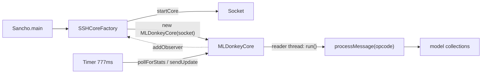
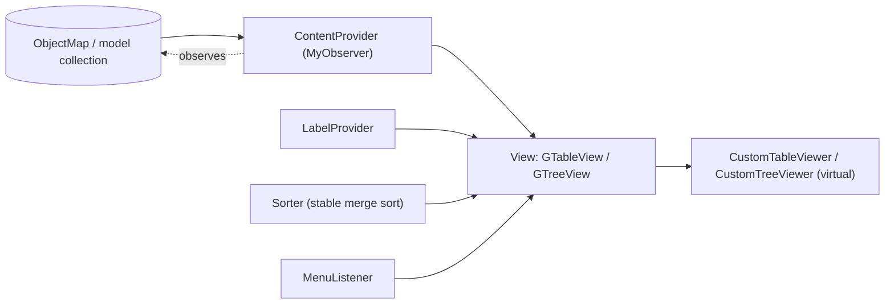
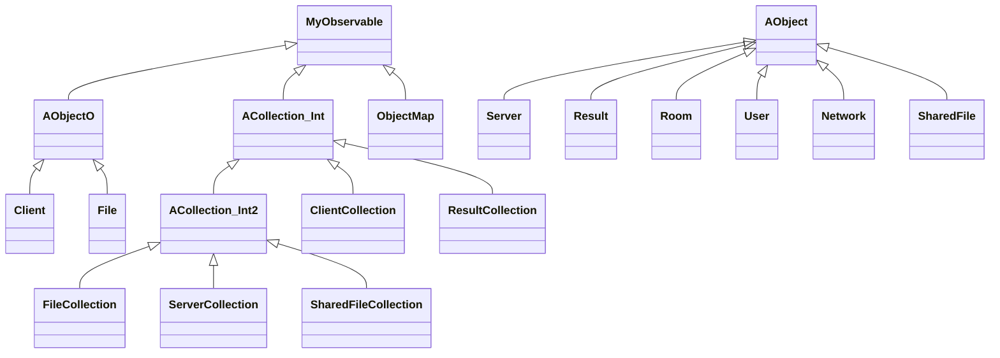
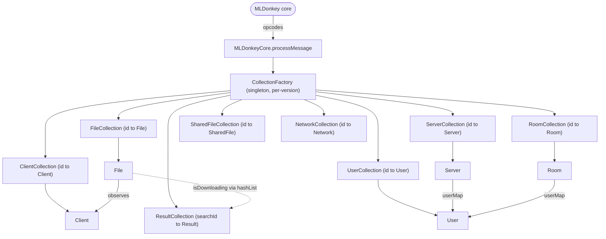

# Components and data model

[← Index](README.md) · [Architecture](ARCHITECTURE.md) · [API / Protocol](API.md) · [Development](DEVELOPMENT.md)

> The **main** classes per package are documented (not all 415). References are `file:line`.

---

## 3.1 Components

### 3.1.1 Package `sancho.core`

Purpose: entry point, core-connection lifecycle and the protocol reader loop.

| Class | Purpose |
|---|---|
| `Sancho` | Entry point (`main`); argument parsing, single instance, splash, `Display`, spawn/connect orchestration, and the app's **global static state** + helpers |
| `CoreFactory` | Base connection manager: opens the TCP socket, creates/authenticates the `MLDonkeyCore`, runs the connect/retry loop on a daemon thread, mediates all dialogs (splash, wizard, password), and observes the core for disconnects |
| `SSHCoreFactory` | Subclass that first opens an **SSH tunnel (JSch)** (local port forward, HTTP/SOCKS proxy) before `super.startCore()`; the concrete factory instantiated by `main` |
| `MLDonkeyCore` | The live connection: reader thread `run()`, handshake, opcode dispatch (`processMessage`), outbound `send`, 777 ms polling `Timer` |
| `MLDonkeyCoreMonitor` | Minimal subclass (mode `-m`): only protocol, "bye" and client statistics |
| `ICore` | Interface (`extends Runnable`): observers, connection state, protocol/version, the 13 collection getters, `send`, `setActiveTab`, `updatePreferences` |
| `Prov` | No-op stub (reconstructed) for GCJ internals; only referenced under an `isGNU()` that is never true on a stock JRE |

**Dependencies:** `sancho.model.mldonkey.*` (collections `processMessage` routes to),
`sancho.model.mldonkey.utility.*` (`MessageBuffer`/`MessageEncoder`), `sancho.utility.*` (observer,
`VersionInfo`, `SwissArmy`), `com.jcraft.jsch` (SSH), `sancho.view.*` (splash, wizard, `BugDialog`, and
— questionable coupling — `instanceof SharesTab`/`TransferTab` in polling).

**Notable public API:**

- `Sancho` (all static): `main(String[])`, `getCore()`, `getCoreFactory()`, `addLink(String)`,
  `send(short[,Object[,…]])`, `pDebug(String)`, `threadException(String,Exception)`, `exit(int)`,
  `hasCollectionFactory()`, `killCoreConsole()`. State: `debug`, `noCore`, `monitorMode`, `automated`,
  `startMinimized/startTray`, `startTime`, `Display`, `CoreFactory`.
- `CoreFactory`: `initialize()`, `connect():int`, `interactiveConnect():int`, `disconnect()`,
  `startCore():int`, `successfulConnect():int`, `run()` (daemon loop), `update(MyObservable,Object,int)`
  (observer), `isConnected()`, `getCore()`, `readPreferences(int)`, mutators
  `setHostPort/setUsername/setPassword/setAutoReconnect/…`. Constants `OK=0`, `CLOSE=1`, `RETRY=2`.
- `SSHCoreFactory`: `initializeSSH():int`, `disconnectSSH()`, `startCore()` (tunnel→super),
  `getHTTPPort():String`, `readPreferences(int,boolean)`; inner `SSHUserInfo` (JSch callbacks).
- `MLDonkeyCore`: ctor `(Socket, user, pass, pollMode)`, `run()`, `connect()/disconnect()`, 13 getters
  `getFileCollection()/getClientCollection()/…`, `send(short[,…])`, `setActiveTab(AbstractTab)`,
  `updatePreferences()`, state `initialized()`, `semaphore()`, `isConnectionDenied()`, `getProtocol()`,
  `getCoreVersion()`. `MAX_PROTOCOL = 41`.

**Thread model:** (1) SWT UI thread; (2) `CoreFactory` daemon connect thread; (3) `MLDonkeyCore` reader
thread; (4) polling `Timer` thread (777 ms); + JSch's internal threads. Background threads marshal to
the UI with `syncExec`/`asyncExec`.

### 3.1.2 Package `sancho.utility`

| Class | Purpose / notable API |
|---|---|
| `MyObservable` | Custom observable (replaces the deprecated `java.util.Observable`). `addObserver` (dedupe), `setChanged/hasChanged`, `notifyObservers([arg[,flags]])`: fires only if `changed`, snapshots under lock, iterates in **reverse order** (`MyObservable.java:59-73`) |
| `MyObserver` | Interface: `update(MyObservable observable, Object arg, int flags)` — the extra **`int flags`** carries the change code |
| `ObjectMap` (extends `MyObservable`) | Observable set with deltas. Constants `ADDED=0/UPDATED=1/REMOVED=2`; main map `HashMap` or `WeakHashMap`; side-maps `WeakHashMap` populated only if observed; `getAndClear{Added,Removed,Updated}` drains them |
| `VersionInfo` | Static info: `getName()`→`"sancho"`, `getVersion()` (from `version.properties`, fallback `0.9.4-dev`), `getOSPlatform()`, `getSWTPlatform()`, `hasTray()` (win32/fox/gtk), `getHomeDirectory()`, GitHub Releases URLs. Old endpoints (SourceForge/awardspace/email) **dead** |
| `SwissArmy` | Static grab-bag: human-readable sizes (`calcStringSize`, `stringSizeToLong` with a TB-overflow fix), times, rates/percents, link regexes (`parseLinks`), `replaceEnvVars` (`%VAR%`), MD4 hex, process spawning (`execInThread`), link sending (`sendLink`/`sfdl2ed2k`), and the **`disableUTF8`** flag (hidden console-decoding switch — keep it; see project memory) |

### 3.1.3 Package `sancho.view` (UI)

#### `MainWindow` (`sancho/view/MainWindow.java:58`)

GUI root and **event loop**; `implements ShellListener, MyObserver, DisposeListener`. Builds: the menu
bar (`MenuBar`), a navigation cool bar (`CToolBar`), a `SashForm` with a `pageContainer` in a
**`StackLayout`** (one page per tab) and the `StatusLine`; tray (`Minimizer`/`MinimizerTray` per
`VersionInfo.hasTray()` + pref). Registers tabs (`ALL_TAB_IDS`, 9 entries) via a reorderable
`IDSelector`. As a `CoreFactory` observer, all callbacks go through `asyncExec` and dispatch by argument
type (`File`→completed dialog, `Boolean`→connect/disconnect fan-out to every tab, `String`→status
line). Global keys: `Ctrl+Shift+←/→` cycles tabs, `Ctrl/Alt+1..9` jumps, `Ctrl+T` sends torrents from
disk.

Subpackage `sancho.view.mainWindow`: `MenuBar` (File/View/Tools/Help menus, rebuilt on `menuShown`),
`CToolBar`, `Minimizer`, `MinimizerTray`.

#### Tabs (all extend `sancho.view.utility.AbstractTab`)

| Tab | Shows |
|---|---|
| `TransferTab` | Downloads as a **tree** (file + per-chunk availability), their sources/clients, uploads, pending, comments, sub-files |
| `SearchTab` | Query editors (`SearchTab_Simple/_Advanced/_Audio` ← `ASearchTab`) + results per query (`ResultTableView`) |
| `ServerTab` | Known servers + users of the selected server |
| `SharesTab` | Shared/uploaded files (`UploadTableView`) |
| `StatisticTab` | Bandwidth graphs (`GraphCanvas`) + per-network tables |
| `ConsoleTab` | MLDonkey text console |
| `FriendsTab` | Friends + their dirs/files + private messages |
| `RoomsTab` | Rooms (one `CTabItem` per room) + users + chat |
| `WebBrowserTab` | Embedded browser (favorites, drag-to-download) |
| `downloadComplete/*` | Completed-download history (dialog, not a main tab) |

`WebBrowserTab_win32` is deliberately disabled (32-bit COM signatures incompatible with 64-bit SWT);
the portable `WebBrowserTab` is always used (`MainWindow.java:304-309`).

#### The JFace MVC quartet (base in `sancho.view.viewer`)

Every table/tree is composed of:

| Role | Base | Responsibility |
|---|---|---|
| **View** | `GView` → `GTableView` / `GTreeView` | Owns the `StructuredViewer`, column metadata, sorter, filters, the auto-sizing dynamic column, the menu. `createContents()` is the **template method** for wiring |
| **ContentProvider** | `GTableContentProvider` → `GTableContentProviderOM` | `IStructuredContentProvider` + `ILazyContentProvider` + `MyObserver`; `getElements` pulls keys from an `ObjectMap`; `onUpdate` reacts (add/update/remove) **inside `asyncExec`**, deferring when the view is invisible |
| **LabelProvider** | `GTableLabelProvider` | `ITableLabelProvider` + `ITableColorProvider`; per-feature `getColumnText(elem, col)`; alternating row colors |
| **Sorter** | `GSorter` | `ViewerSorter` with a custom **stable merge sort** (tolerates live-mutating values that would break TimSort); typed comparators (`compareInts/Longs/Percents/Strings/Addrs/ClientStates`) |
| **MenuListener** | `GTableMenuListener` | `IMenuListener` + `ISelectionChangedListener`; menus (clipboard, UID-link submenu, web-services, select-all) and keys (Ctrl+A, Delete, F2) |

Support: `viewer/actions` (~24 `Action`s), `viewer/filters` (`AbstractViewerFilter` +
State/Network/FileExtension/Word/Refine, serialized to prefs as ints). A `ViewFrame` sets the model
collection as input (`onConnect → gView.setInput()`); the content provider registers as a `MyObserver`
of the `ObjectMap`; core-thread mutations fire callbacks → `asyncExec` → incremental `add/update/remove`
on the virtual table.

#### Injected JFace (`org.eclipse.jface.viewers`)

- `ICustomViewer` — common interface (`get/setColumnIDs`, `setInput`, `updateDisplay`, `clearAll`).
- `CustomTableViewer extends TableViewer implements ICustomViewer` — **virtual/lazy** table with its own
  `parentToItemMap`, selection marshalling, and `myClear`/`replace` fixes for stale/duplicate rows.
- `CustomTreeViewer extends TreeViewer` — analogous tree with expansion tracking, a chunk-image cache
  and cell editors.

Why the injection and the unsigned JFace: see
[ARCHITECTURE §2.4](ARCHITECTURE.md#24-the-orgeclipsejfaceviewers-injection-deliberate-coupling).

#### Preferences (`sancho.view.preferences`)

- `CPreferenceManager extends PreferenceManager` — registers static pages (`RootPreferencePage`,
  `DisplayPreferencePage`, and on Windows/debug `WinRegPreferencePage`), and **builds pages dynamically
  from the core's options** (grouped by section/plugin into "Core:" pages, "Networks", "Advanced",
  "All").
- `CPreferencePage extends PreferencePage` — base for Sancho pages: collects `FieldEditor`s in
  `editorList` and persists them in `performOk`/`performDefaults`; factory helpers
  `setupBooleanEditor/setupIntegerEditor/setupStringEditor/setupColor/Font/Directory/FileEditor`;
  localized OK/Apply/Defaults buttons.
- `RootPreferencePage` — General/Downloads/Search/Console/Graph/Rooms/WebBrowser tabs.
- `MLDonkeyPreferencePage extends FieldEditorPreferencePage` — one editor per core `Option` (with a
  reflective `clearEditors` shim over JFace internals).
- `WinRegPreferencePage` — Windows associations (protocols + `.torrent`), per-association status and a
  startup check; backed by `WinRegAssociations` (SWT-free registry logic) and `AssociationChecker`
  (startup prompt from `MainWindow.java:179`).
- `MLDonkeyPreferenceStore extends PreferenceStore` — **adapter** over the live `OptionCollection`.

#### i18n (`SResources`)

Single string/image registry. `getString(key)` (returns the key on a miss); registry populated in a
static initializer from the `sancho` `ResourceBundle`. Language by the `locale` pref / `-f` (never the
OS). `ImageRegistry` with ~250 icons (clients/networks/file types, country flags, states). Encoding
details in [DEVELOPMENT §5.1.3](DEVELOPMENT.md#513-internationalization-i18n).

---

## 3.2 Data model

Package `sancho.model.mldonkey`. The model is mutated by `MLDonkeyCore`'s **single reader thread** and
observed by the UI.

### 3.2.1 Base hierarchy

| Base | Role |
|---|---|
| `AObject` (`AObject.java:5`) | Minimal object (only `ICore core`). Non-observable: used by `Server`, `Result`, `Room`, `User`, `Network`, `SharedFile` |
| `AObjectO` (`AObjectO.java:6`) | Observable: `extends MyObservable implements IObject`. Used by `Client` and `File` |
| `ACollection_Int` (`:11`) | Observable collection: `extends MyObservable`, wraps a Trove `TIntObjectHashMap` (id→object) |
| `ACollection_Int2` (`:8`) | Adds added/removed/updated delta tracking with `WeakHashMap` |
| `IObject` / `ICollection` | `read(MessageBuffer)`+`deleteObservers()` / `dispose()` |

**Protocol-version factories** (never `new` at call sites):

- `CollectionFactory` — picks the entity subclass by `protocolVersion` (`getFile()` → `File41/…/File18/
  File`, etc.) and is a **singleton** that also owns/caches every collection.
- `UtilityFactory` — picks protocol variants of wire helpers (`Addr38/34/Addr`, `Kind39/Kind`,
  `HostState21/HostState`).

This lets the app talk to cores of protocol 16–41.

### 3.2.2 Entities

| Entity | Base | Represents | Key fields |
|---|---|---|---|
| `File` (`:37`) | `AObjectO` + `MyObserver` | A download | `id`, `md4`, `name/names[]`, `size`, `downloaded`, `rate`, `percent`, `sources/activeSources`, `chunks/chunkAges[]/avail`, `priorityEnum`, `fileStateEnum`, `networkEnum`, `eta`, `clientWeakMap` (sources). Bitmask `changedBits` + `notifyChangedProperties()` |
| `Client` (`:24`) | `AObjectO` | A peer/source | `id`, `name`, `kind` (`Kind`), `stateEnum` (`EnumHostState`), `enumClientType` (SOURCE/FRIEND/CONTACT), `networkEnum`, `rating`, `avail` (fileId→availability), `clientFilesMap`. Constants `CONNECTED/DISCONNECTED/TRANSFERRING_ADD/REM/…` as `flags` |
| `Server` (`:18`) | `AObject` | An eDonkey/overnet server | `id`, `addr` (`Addr`), `port`, `name/description`, `numFiles/numUsers`, `score`, `stateEnum`, `preferred`, `userMap`, `networkEnum` |
| `Result` (`:17`) | `AObject` + `IObject_UID` | A search hit (near-immutable) | `id`, `md4`, `names[]`, `size`, `format/type`, parsed tags (`tag_bitrate/length/codec/availability`), `rating` (`EnumRating`), flags `containsFake/Pornography/Profanity` |
| `Room` (`:10`) | `AObject` | A chat room | `id`, `name`, `roomState` (`EnumRoomState`), `networkEnum`, `userMap` |
| `User` (`:10`) | `AObject` | A user | `id`, `md4`, `name`, `addr`, `port`, `serverId`, `tags[]` (shared by reference between `Server.userMap` and `Room.userMap`) |
| `Network` (`:11`) | `AObject` | A P2P network | `id`, `name`, `enabled`, `enumNetwork`, `uploaded/downloaded` (uint64); predicates `hasServers/hasRooms/hasUpload/hasChat/isSearchable` |
| `SharedFile` (`:19`) | `AObject` + `IObject_UID` + `IPreview` | A shared file | `id`, `md4`, `name`, `size`, `bytesUploaded` (uint64), `requests` |

Each entity has per-version subclasses (`File18…File41`, `Server28/29/32/40`,
`Client19/20/21/23/33/35`, `Result25/27`, `Network18/41`, `SharedFile25/31/37/41`). Non-entity objects:
`ClientStats`, `ConsoleMessage`, `Option`, and payloads `Tag`, `ClientMessage`, `RoomMessage`,
`SearchWaiting`, `NetworkStat*`.

### 3.2.3 Collections (the `ACollection_Int` pattern)

Each collection wraps a `TIntObjectHashMap` (core id → object); `synchronized final` accessors
(`get/put/remove/size/clear`). **The collection *is* the observable** that tables subscribe to.

- **Iteration = Trove visitor/procedure pattern** (no `Iterator`): `forEachValue(TObjectProcedure)` /
  `forEachEntry(TIntObjectProcedure)`; `execute(...)` returns `true` to continue, `false` for **early
  stop** (aggregators like `SharedFileCollection.CalculateTotalSize`). `retainEntries(TIntObjectProcedure)`
  prunes in place (returning `false` **removes**) — used by the core's "clean tables"
  (`ClientCollection.clean`, `ServerCollection.clean`).
- **Delta layer `ACollection_Int2`**: three `WeakHashMap`s (added/removed/updated), populated only if
  observed; the view drains them with `getAndClear*`. Extended by `FileCollection`, `ServerCollection`,
  `SharedFileCollection`. `ClientCollection`/`ResultCollection` extend the base.
- **Notification**: mutators do `setChanged(); notifyObservers()`. `FileCollection.sendUpdate()`
  **throttles** to `updateDelay*777 ms` and only if `hasChanged()` (pulsed by the core's `Timer`).
  `FileCollection` keeps `hashList` of active MD4s so `Result.isDownloading()` is cheap.

Concrete collections: `FileCollection`, `ClientCollection`, `ServerCollection`, `ResultCollection` (the
most complex: flat result map + per-search map with `ObjectMap` and cross indexes), `RoomCollection`,
`UserCollection`, `SharedFileCollection`, `NetworkCollection`, `OptionCollection`,
`DefineSearchesCollection`.

### 3.2.4 Wire DTOs (`sancho.model.mldonkey.utility`)

| DTO | Role |
|---|---|
| `MessageBuffer` / `MessageEncoder` | Read/write the binary format (see [API §4.2](API.md#42-mldonkey-gui-protocol)) |
| `OpCodes` | Opcode constants (barely used: the code uses literals) |
| `Tag` | Typed name/value tuple; `read` branches on `EnumType` (STRING/U_INT16/U_INT8/IPADDRESS/PAIR/int) |
| `Addr` / `Addr34` / `Addr38` | IPv4 (4 bytes) or hostname + optional country code; `Comparable` for sorting |
| `Kind` / `Kind39` | Client locator: DIRECT (addr+port) vs FIREWALLED (hostname+md4) |
| `HostState` / `HostState21` | State byte → `EnumHostState` + rank (queue position) |
| `FileState` | `EnumFileState` + optional abort reason |
| Others | `Format`/`Format_OGx`, `Query`/`SearchQuery`, `RoomMessage`, `ClientMessage`, `SearchWaiting`, `NetworkStat*` |

### 3.2.5 Enumerations (`sancho.model.mldonkey.enums`)

All extend `AbstractEnum` (`int value` bit-flag + localized `name`; `getIntValue()` = log2). **Not Java
`enum`s** — classes with static singletons and `byteToEnum`/`intToEnum`/`stringToEnum` decoders.

| Enum | Represents |
|---|---|
| `EnumHostState` | Client/server connection state (NOT_CONNECTED, CONNECTING, CONNECTED_DOWNLOADING, CONNECTED_AND_QUEUED, BLACKLISTED, …) |
| `EnumFileState` | Download state (DOWNLOADING, PAUSED, DOWNLOADED, SHARED, CANCELLED, NEW, ABORTED, QUEUED) |
| `EnumClientType` | SOURCE / FRIEND / CONTACT |
| `EnumClientMode` | DIRECT / FIREWALLED |
| `EnumNetwork` | P2P network (DONKEY, SOULSEEK, GNUT/GNUT2, OV, BT, FT, OPENNP, DC, MULTINET, FILETP) + prefixes/icons |
| `EnumPriority` | Priority VERY_LOW…VERY_HIGH (-20…20) |
| `EnumRating` | Result rating (EXCELLENT…LOW, FAKE) |
| `EnumExtension` | File-type category (AUDIO/VIDEO/ARCHIVE/…); `TreeMap` extension→category |
| `EnumFormat` | Media container (AVI/MP3/OGX/GENERIC) |
| `EnumRoomState` | OPEN / CLOSED / PAUSED |
| `EnumMessage` | Message scope SERVER/PUBLIC/PRIVATE |
| `EnumQuery` | Search AST nodes (AND/OR/ANDNOT/KEYWORDS/MINSIZE/FORMAT/MP3_*) |
| `EnumTagType` / `EnumType` | Tag/option payload types (overlap — a smell) |
| `AbstractEnum` | Shared base (not itself an enum) |

### 3.2.6 Entity / collection relationships

Opcode routing: op 46/52/53 → `FileCollection`; 15/16/18 → `ClientCollection`; 13/26 →
`ServerCollection`; 4/5/6 → `ResultCollection`; 23/24/31/32 → `RoomCollection`; 21 → `UserCollection`;
34/35/48 → `SharedFileCollection`; 20/59 → `NetworkCollection`. See [API §4.2.3](API.md#423-opcodes).

**Observation flow:** the core writes fields → `object.setChanged()/notifyObservers(arg, flags)` and/or
`collection.setChanged()+addToUpdated` → throttled `sendUpdate()` → incremental JFace table refresh
(inside `asyncExec`).

- _Not deducible from code:_ the exact byte layout of each opcode (only inferable from the `read*`
  order); which specific core version each protocol number maps to (only `MAX_PROTOCOL = 41` is stated).
